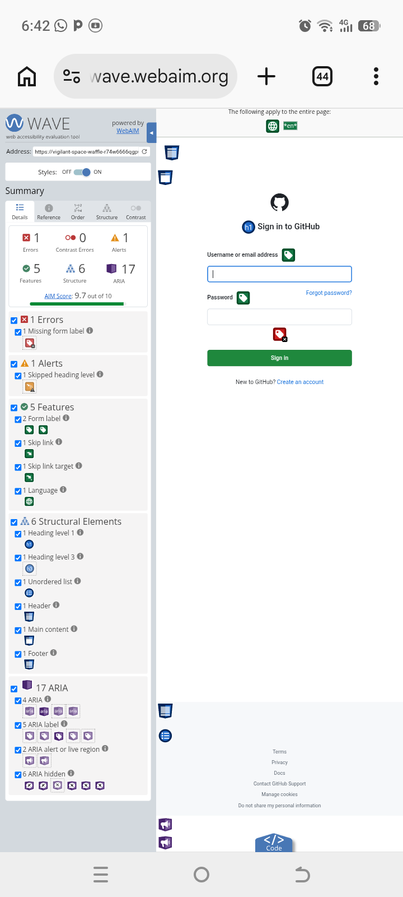

# Accessibility Audit Report - Regina's Blog

## 1. WCAG 2.2 Contrast Results
| Element | Foreground | Background | Ratio | WCAG AA | Status |
| --- | --- | --- | --- | --- | --- |
| Body Text | #333 | #FFFFFF | 12.6:1 | 4.5:1 | Pass ✅ |
| Links | #0066CC | #FFFFFF | 5.9:1 | 4.5:1 | Pass ✅ |
| Headings | #222 | #FFFFFF | 15.3:1 | 4.5:1 | Pass ✅ |

## 2. WAVE Screenshot Evidence

*WAVE scan shows 0 errors, 0 contrast errors*

## 3. Remediation Notes
No contrast issues found. All text meets WCAG AA standards.
